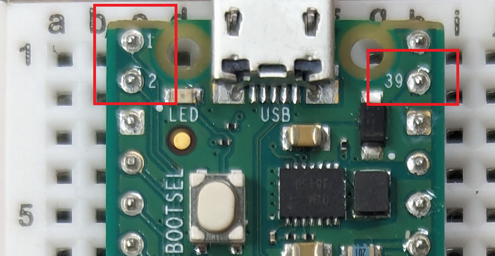

# Physical Computing Day 2

Welcome back! Today we're continuing with the Raspberry Pi Pico and learning
how to build a simple circuit to control external elements.

## Pins

The Pico board has 40 pins that can be used to connect a number of external
devices. These pins are divided into two groups: general purpose input/output
(GPIO) pins and special function pins. Today, we'll be working with a small
subset of the GPIO pins to control an LED, but you can find the complete
pinout [here](https://www.raspberrypi.com/documentation/microcontrollers/raspberry-pi-pico.html#raspberry-pi-pico-w-and-pico-wh).

We'll usually identify the pins by their _number_ rather than their _name_. The numbers are partially printed on the board:

## Breadboard

Your Raspberry Pi is probably already attached to a breadboard, which is a tool that allows us to easily connect parts of a circuit together. The board is made up of a grid of holes which are connected by strips of metal so that electrical current can flow between them. In the center of the board, holes in the same row are connected while holes on the edges of the board are connected vertically. These vertically connected pins are known as _power rails_.

